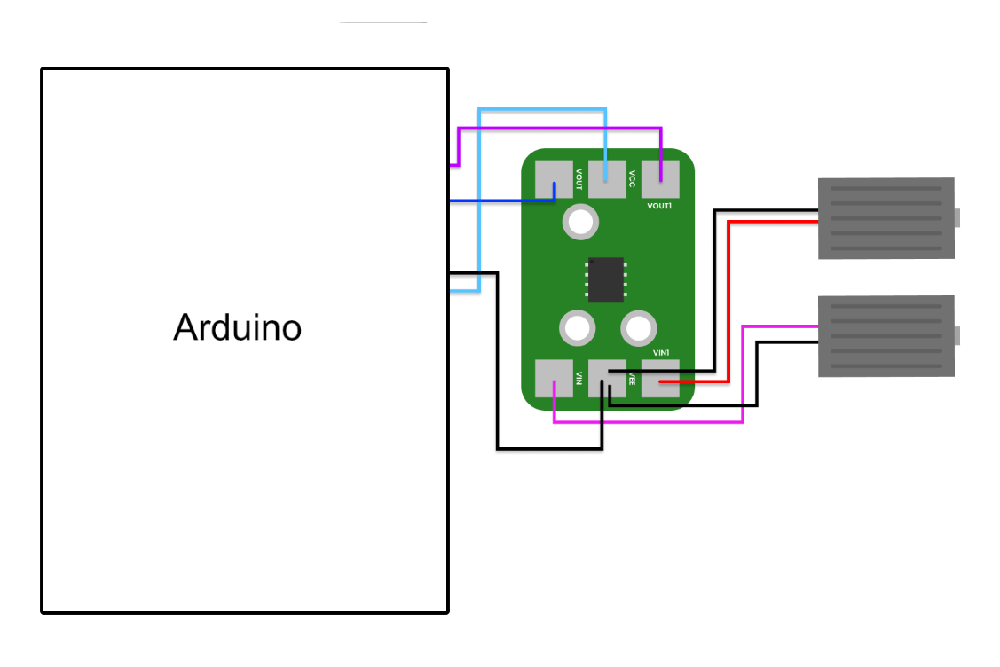

# Introduction to BB84

## What is it?

The BB84 protocol utilizes the uncertainty principle of quantum mechanics and a set of conjugate polarization states of light in order to generate a one time secret key, also known as a `one time pad`, that can be used to communicate securely. The destructive nature of quantum measurements ensures that anyone trying to eavesdrop on this key generation will have a high probability of disrupting the key generation process and thus be detected.

## Why Does It Work?

This readme will focus mainly on the implementation of an automated version of the protocol. For further information see [this poster](docs/BB84_Quantum_Protocol_Adem_Akyasar_Poster.pdf), [this writeup](docs/Quantum_Cryptography_BB84.pdf), or [Bennett and Brassard's original 1984 paper](https://doi.org/10.1016/j.tcs.2014.05.025).

  

## The Protocol

A sender, "Alice", first selects a random sequence of bits as well as bases. "Alice" then goes through these sequences and sends photons encoded in the polarization state corresponding to the random basis and bit. With a $0^\circ$ and $-45^\circ$ polarized photon representing a **logical 0** in the rectilinear and diagonal bases respectively; while a $90^\circ$ and $45^\circ$ polarized photon represents a **logical 1** in the rectilinear and diagonal bases respectively.

A receiver, "Bob", independently selects a random sequence of bases to measure in. "Bob" measures each photon "Alice" sends and interprets each measurement as a **logical 1** or **logical 0**. After a measurement "Bob" prepares to measure in the next basis in his sequence. If "Bob" did not measure in the same basis that "Alice" sent in then the interpreted bit is entirely random(as per the above image).

Now, both parties have a sequence of bits along with a sequence of bases in which those bits were measured or sent. "Alice" and "Bob" can now publicly compare their base sequences, they agree to disregard any bits in their sequence where the corresponding basis do not agree. They can also determine if any photons were lost in transit and discard those. If all went well "Alice" and "Bob" should each have a matching key known only to them.

However, if an eavesdropper "Eve" may attempt to discreetly figure out this secret key by intercepting the photons from "Alice" and relaying their measurement to "Bob". But, because of quantum mechanical reasons discussed in the links above, this intrusion will surely tip off "Alice" and "Bob" to the presence of this eavesdropper. In order to root out a possible eavesdropper "Alice" and "Bob" compare a subset of their generated key; if all was well this should match perfectly, however, in the presence of an eavesdropper they expect about 25% of their generated keys to not match.

# Automating the protocol

## Starting Point

This kit from Thor Labs provides a good starting point, but everything must be done manually which can get tedious for one times pads more than a few bits long. We need a way to perform this protocol automatically. We can split this into three parts:

### Alice(The Sender)

1. Toggle a linearly polarized laser on and off with microsecond precision to generate pulses
2. Rotating the polarization of our light pulse to our desired bit and basis automatically
3. Keeping track of outgoing states

### Bob(The Receiver)

1. Measuring the polarization of an incoming pulse
2. Keeping track of incoming states
3. Change Bases automatically after a measurement

### Eve(The Eavesdropper)

1. Eve, essentially being made of an Alice and Bob component, should simply be a combination of the two.

## In comes Arduino

To solve these problems we use micro-controllers called Arduino. This micro-controller is capable of being programmatically controlled via `C++` and allows us to read analog input voltages(0 to 5V), control digital pins(0 or 5V).

### Toggling the laser

We use an Arduino and a MOSFET(BJT's have too much voltage loss) in order to toggle the 635nm laser diode module on and off with speed. We need to use a transistor as the Arduino's digital pins have a current limit that the laser would surpass.

  

### Measuring Pulses

To measure the state of a light pulse we can utilize the the wave plate, beam splitter, and double photometer combination used in the original kit. However, the photometers are quite interoperable with the arduino by default as when light is detected the voltage of photometer may be negative and this could cause damage. The solution was to use a custom designed single supply inverting amplifier printed circuit board(PCB). The amplifier and its implementation is shown below.

  

### Rotating Wave Plates

To automate the rotation of the wave plates thus automating the measurement base selection we found the ELL14 motorized rotation mount was the right fit for the project(Along with the ELLB controller). It is capable of being controlled via a computer software or via a serial communication protocol outlined in the devices documentation. This allows to control the rotation of our wave plate programmatically over serial.

  

#### Mounting

Our mounting solution was a custom designed 3D printed holder that worked well with an optical bread board.

  

